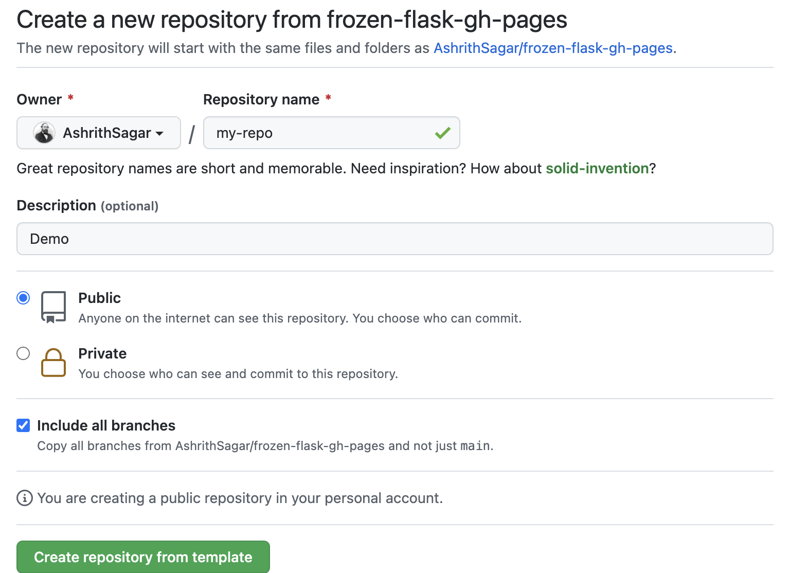
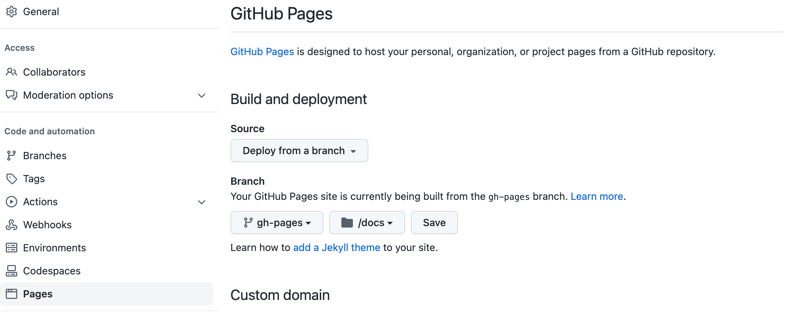

# frozen-flask-gh-pages
> Host Frozen-Flask on GitHub Pages

- Flask
  https://flask.palletsprojects.com/

- Frozen-Flask
https://pythonhosted.org/Frozen-Flask/

- GitHub Pages
https://pages.github.com/

## How to use

1. Use this templatae to create a new repository with *all branches*. It can either be Public/Private.

   

2. Go to `Settings > Pages` and configure GitHub Pages to deploy from  `docs/` directory.

   

3. Create a virtual environment and install dependencies.

   ```shell
   python3 -m venv .venv
   source .venv/bin/activate
   pip3 install -r requirements.txt
   ```

4. Change the `FREEZER_BASE_URL` to the new Repository name.
   ```python
   app = Flask(__name__)
   # Enter your GitHub Pages URL here instead of frozen-flask-gh-pages
   app.config['FREEZER_BASE_URL'] = 'https://docs/frozen-flask-gh-pages/'
   ```

5. Run the server

   ```shell
   python3 app.y
   ```

6. The static website files are stored in `docs/` directory on `gh-pages` branch, which will be hosted on GitHub Pages.

## License

MIT License
